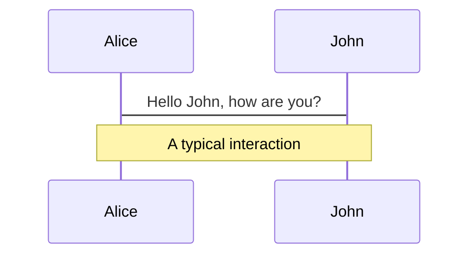
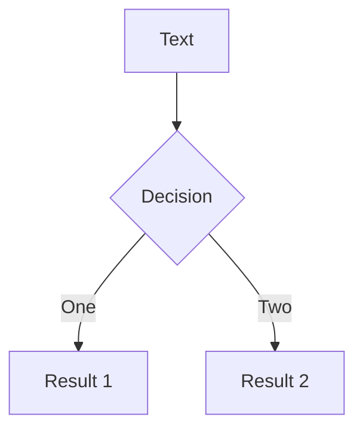
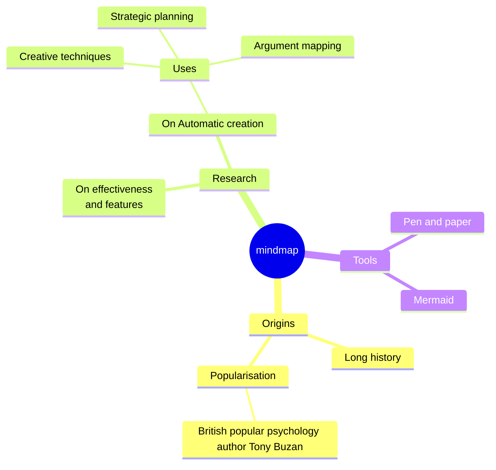
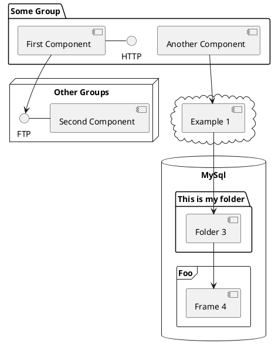

---
# You can also start simply with 'default'
theme: default
# random image from a curated Unsplash collection by Anthony
# like them? see https://unsplash.com/collections/94734566/slidev
background: https://cover.sli.dev
# some information about your slides (markdown enabled)
title: Vue3基础
info: |
  ##
  Learn more at [vuejs](https://cn.vuejs.org/)
# apply unocss classes to the current slide
class: text-center
# https://sli.dev/custom/highlighters.html
highlighter: shiki


# 幻灯片的配色方案，可以使用 'auto'，'light' 或者 'dark'
colorSchema: auto
# https://sli.dev/guide/drawing
drawings:
  persist: false
# slide transition: https://sli.dev/guide/animations#slide-transitions
transition: slide-left
# enable MDC Syntax: https://sli.dev/guide/syntax#mdc-syntax
mdc: true
---

# Vue3基础

<div class="pt-12">
  <span @click="$slidev.nav.next" class="px-2 py-1 rounded cursor-pointer" hover="bg-white bg-opacity-10">
    高咪咪 <carbon:arrow-right class="inline"/>
  </span>
</div>

<div class="abs-br m-6 flex gap-2">
  <button @click="$slidev.nav.openInEditor()" title="Open in Editor" class="text-xl slidev-icon-btn opacity-50 !border-none !hover:text-white">
    <carbon:edit />
  </button>
  <a href="https://github.com/slidevjs/slidev" target="_blank" alt="GitHub" title="Open in GitHub"
    class="text-xl slidev-icon-btn opacity-50 !border-none !hover:text-white">
    <carbon-logo-github />
  </a>
</div>

---
transition: fade-out
---

# 什么是Vue?

Vue (发音为 /vjuː/，类似 view) 是一款用于构建用户界面的 JavaScript 框架。它基于标准 HTML、CSS 和 JavaScript 构建，并提供了一套声明式的、组件化的编程模型，帮助你高效地开发用户界面。

Vue 3 的新特性
- **组合式API** - 这是Vue 3最重要的新特性之一，它允许更灵活、更逻辑化地组织代码。
- **更好的性能** - Vue 3的虚拟DOM重写，提供了更快的挂载、修补和渲染速度。
- **更小的打包大小** - 由于新的架构和树摇技术，Vue 3的打包大小比Vue 2小。
- **更好的TypeScript支持** - Vue 3在内部使用了TypeScript，因此它为开发者提供了更好的TypeScript支持。

---
layout: default
layoutClass: gap-4
---

# 什么是组合式API？

在 Vue 3 中引入的一种新的编写 Vue 组件的方式。

````md magic-move {lines: true}
```js {all|5|9-11|13-15|all}
<script>
export default {
  data() {
    return {
      count: 0
    }
  },
  methods: {
    increment() {
      this.count++
    }
  },
  mounted() {
    console.log(`The initial count is ${this.count}.`)
  }
}
</script>
<template>
  <button @click="increment">Count is: {{ count }}</button>
</template>
```


```vue
<script>
import { ref, onMounted } from 'vue'
export default{
  setup(){ //setup 函数是组件的入口点，在组件实例被创建和初始化之后，但在渲染发生之前被调用。
    // 响应式状态
    const count = ref(0)
    // 用来修改状态、触发更新的函数
    function increment() {
      count.value++
    }
    // 生命周期钩子
    onMounted(() => {
      console.log(`The initial count is ${count.value}.`)
    })
    return{
      count,
      increment
    }
  }
}
</script>

<template>
  <button @click="increment">Count is: {{ count }}</button>
</template>
```


```vue
<script setup>
import { ref, onMounted } from 'vue'

// 响应式状态
const count = ref(0)

// 用来修改状态、触发更新的函数
function increment() {
  count.value++
}

// 生命周期钩子
onMounted(() => {
  console.log(`The initial count is ${count.value}.`)
})
</script>

<template>
  <button @click="increment">Count is: {{ count }}</button>
</template>
```
````
---
transition: slide-up
level: 2
---

## 创建一个Vue 3 项目
使用create-vue创建项目
前提环境条件：已安装16.0或者更高版本的Node.js
```shell
npm init vue@latest
```
我们按照提示需求进行安装即可


---
transition: fade-out
---

# 响应式原理


---
layout: two-cols-header
layoutClass: gap-2
---

# ref vs reactive
Vue 3提供了两个主要的函数来创建响应式数据：ref 和 reactive。

::left::

## ref
```js
import { ref } from 'vue'

let foo = 0
let bar = ref(0)

foo = 1
bar = 1 // ts-error
```

PROS
- 显式调用，类型检查
- 相比reactive 局限小
CONS
- .value

::right::

## reactive
```js
import { reactive } from 'vue'

const foo = { prop: 0 }
const bar = reactive({ prop: 0 })

foo.prop = 1
bar.prop = 1
```

PROS
- 自动Unwrap(即不需要.value)
CONS
- 在类型上和一般对象没有区别
- 使用ES6 解构会使响应性丢失
- 需要使用箭头函数包装才能使用watch

---
transition: slide-up
---

# 模板语法
Vue 使用一种基于 HTML 的模板语法，使我们能够声明式地将其组件实例的数据绑定到呈现的 DOM 上。

<div grid="~ cols-2 gap-2">
<div>文本插值</div>
<div>原始 HTML</div>
```vue
<span>Message: {{ msg }}</span>
const msg = ref('Hello World')
```

```vue
const rawHtml = ref('<span style="color:red">Hi!</span>')
<template>
  <p>Using v-html directive:
    <span v-html="rawHtml"></span>
</p>
</template>
```
<!-- ./components/HelloWorld.vue -->
<HelloWorld v-click />

<HtmlRender v-click />

</div>

- 文本插值

最基本的数据绑定形式是文本插值，它使用的是“Mustache”语法 (即双大括号)：双大括号标签会被替换为相应组件实例中 msg 属性的值。同时每次 msg 属性更改时它也会同步更新。

- 原始 HTML

双大括号会将数据解释为纯文本，而不是 HTML。若想插入 HTML，你需要使用 v-html 指令：


---

# 模板语法

- Attribute 绑定

双大括号不能在 HTML attributes 中使用。想要响应式地绑定一个 attribute，应该使用 v-bind 指令：
````md magic-move
```vue
<div v-bind:id="dynamicId"></div>
```

```vue
<div :id="dynamicId"></div>
```

```vue
<div :id="id"></div>
```

```vue
<div :id></div>
```
````

- 动态绑定多个值
```vue
const objectOfAttrs = {
  id: 'container',
  class: 'wrapper'
}
<div v-bind="objectOfAttrs"></div>
<div :id="objectOfAttrs.id" :class="objectOfAttrs.class"></div>
```

- 使用 JavaScript 表达式

```js
{{ number + 1 }}

{{ ok ? 'YES' : 'NO' }}

{{ message.split('').reverse().join('') }}

```
---
layout: two-cols
layoutClass: gap-4
transition: fade-out
---

# computed

````md magic-move {lines:true}
```ts
<script setup>
import { reactive, computed } from 'vue'

const arr = ref([1,2,3,4,5,6,7])

<template>
  <p>原始数组:{{ arr }}</p>
  <span>
    {{ arr.value.filter((item) => item > 2) }}
  </span>
</template>
```

```ts
<script setup>
import { reactive, computed } from 'vue'

const arr = ref([1,2,3,4,5,6,7])

// 一个计算属性 ref
const arrFilter = computed(() => {
  return arr.value.filter((item) => item > 2)
})
</script>

<template>
  <p>原始数组:{{ arr }}</p>
  <span>{{ arrFilter }}</span>
</template>
```
````
::right::

计算属性（computed properties）是基于响应式依赖进行缓存的属性。它们只有在其依赖发生变化时才会重新计算。这使得计算属性非常适合处理复杂逻辑和性能优化。

- 注意点

**计算属性中不应该有"副作用"**

比如: 异步请求/修改dom

什么副作用,计算属性的主要作用是依赖响应式数据进行计算获取一个新的值,除了这个作用之外,我们加上去别的都是副作用

这些副作用,我们可以交给watch来做

**避免直接修改计算属性的值**

从计算属性返回的值是派生状态。可以把它看作是一个“临时快照”，每当源状态发生变化时，就会创建一个新的快照。
更改快照是没有意义的，因此计算属性的返回值应该被视为只读的，并且永远不应该被更改——应该更新它所依赖的源状态以触发新的计算。

<style>
p {
  font-size:14px
}
</style>

---
layout: two-cols
layoutClass: gap-2
---

# 类与样式绑定

- 绑定 HTML class

```vue
<!-- /绑定对象/ -->
<div :class="{ active: isActive }"></div>
<!-- :class 指令也可以和一般的 class attribute 共存 -->
<div class="static" :class="{ active: isActive, 'text-danger': hasError }"></div>

const classObject = reactive({
  active: true,
  'text-danger': false
})

<div :class="classObject"></div>
```

```vue
<!-- 绑定数组 -->
const activeClass = ref('active')
const errorClass = ref('text-danger')
<div :class="[activeClass, errorClass]"></div>
<div :class="[isActive ? activeClass : '', errorClass]"></div>
```


::right::

绑定内联样式

``` vue
<!-- 绑定对象 -->
<!-- :style 支持绑定 JavaScript 对象值，对应的是 HTML 元素的 style 属性： -->
const activeColor = ref('red')
const fontSize = ref(30)

<div :style="{ color: activeColor, fontSize: fontSize + 'px' }"></div>

const styleObject = reactive({
  color: 'red',
  fontSize: '30px'
})
<div :style="styleObject"></div>
```

```vue {all|13}{maxHeight:'100'}
<!-- 绑定数组 -->
<!-- :style 绑定一个包含多个样式对象的数组。这些对象会被合并后渲染到同一元素上 -->
const styleArray = reactive([
  {
    color: 'blue', // 样式对象1
    fontSize: '14px'
  },
  {
    backgroundColor: 'yellow', // 样式对象2
    padding: '10px'
  }
])
<div :style="styleArray"></div>
```

---
layout: two-cols
layoutClass: gap-2
---

# 条件渲染

<ConditionalRendering />

```js
<div v-if="type == 'A'">A</div>
<div v-else-if="type == 'B'">B</div>
<div v-else-if="type == 'C'">C</div>
<div v-else>Not A/B/C</div>
```

`v-if`

- 是“真实的”按条件渲染，因为它确保了在切换时，条件区块内的事件监听器和子组件都会被销毁与重建。
- 是惰性的：如果在初次渲染时条件值为 false，则不会做任何事。条件区块只有当条件首次变为 true 时才被渲染。
- 有更高的切换开销

::right::

```js {13-14}
<script setup>
import { ref } from 'vue'

const awesome = ref(true)

function toggle() {
  awesome.value = !awesome.value
}
</script>

<template>
  <button @click="toggle">toggle</button>
  <h1 v-if="awesome">Vue is awesome!</h1>
  <h1 v-else>Oh no 😢</h1>
</template>
```

`v-show`

- 会在 DOM 渲染中保留该元素；
- 仅切换了该元素上名为 `display` 的CSS属性。
- 不支持在 `<template>` 元素上使用，也不能和 `v-else` 搭配使用。
- 有更高的初始渲染开销

<style>
ul,li{
  font-size:14px
}
</style>

---

# 列表渲染
`v-for`
<div grid="~ cols-2 gap-2">

```vue
const parentMessage = ref('Parent')
const items = ref([{ message: 'Foo' }, { message: 'Bar' }])

<li v-for="(item, index) in items">
  {{ parentMessage }} - {{ index }} - {{ item.message }}
</li>
```

```vue
const myObject = ref({
  title: 'How to do lists in Vue',
  author: 'Jane Doe',
  publishedAt: '2016-04-10'
})
<li v-for="(value, key) in myObject">
  {{ key }}: {{ value }}
</li>
```

</div>


你也可以使用 `v-for` 来遍历一个对象的所有属性。遍历的顺序会基于对该对象调用 `Object.keys()` 的返回值来决定。


**同时使用 v-if 和 v-for 是不推荐的**

当它们同时存在于一个节点上时，`v-if` 比` v-for` 的优先级更高。这意味着 `v-if` 的条件将无法访问到 `v-for` 作用域内定义的变量别名。

<style>
p {
  font-size:12px
}
</style>

---

# 事件处理

## 监听事件

## 内联事件处理器

---
layout: two-cols
layoutClass: gap-16
transition: fade-out
---
# watch
作用: 侦听一个或者多个数据的变化,数据变化时执行回调函数
两个额外参数: 1.immediate(立即执行) 2.deep(深度侦听)


---
layout: image-right
image: https://cover.sli.dev
---

# 表单输入绑定

Use code snippets and get the highlighting directly, and even types hover![^1]

```ts {all|5|7|7-8|10|all} twoslash
// TwoSlash enables TypeScript hover information
// and errors in markdown code blocks
// More at https://shiki.style/packages/twoslash

import { computed, ref } from 'vue'

const count = ref(0)
const doubled = computed(() => count.value * 2)

doubled.value = 2
```

<arrow v-click="[4, 5]" x1="350" y1="310" x2="195" y2="334" color="#953" width="2" arrowSize="1" />

<!-- This allow you to embed external code blocks -->
<<< @/snippets/external.ts#snippet

<!-- Footer -->
[^1]: [Learn More](https://sli.dev/guide/syntax.html#line-highlighting)

<!-- Inline style -->
<style>
.footnotes-sep {
  @apply mt-5 opacity-10;
}
.footnotes {
  @apply text-sm opacity-75;
}
.footnote-backref {
  display: none;
}
</style>

<!--
Notes can also sync with clicks

[click] This will be highlighted after the first click

[click] Highlighted with `count = ref(0)`

[click:3] Last click (skip two clicks)
-->

---
level: 2
---

# 生命周期

Powered by [shiki-magic-move](https://shiki-magic-move.netlify.app/), Slidev supports animations across multiple code snippets.

Add multiple code blocks and wrap them with <code>````md magic-move</code> (four backticks) to enable the magic move. For example:

````md magic-move {lines: true}
```ts {*|2|*}
// step 1
const author = reactive({
  name: 'John Doe',
  books: [
    'Vue 2 - Advanced Guide',
    'Vue 3 - Basic Guide',
    'Vue 4 - The Mystery'
  ]
})
```

```ts {*|1-2|3-4|3-4,8}
// step 2
export default {
  data() {
    return {
      author: {
        name: 'John Doe',
        books: [
          'Vue 2 - Advanced Guide',
          'Vue 3 - Basic Guide',
          'Vue 4 - The Mystery'
        ]
      }
    }
  }
}
```

```ts
// step 3
export default {
  data: () => ({
    author: {
      name: 'John Doe',
      books: [
        'Vue 2 - Advanced Guide',
        'Vue 3 - Basic Guide',
        'Vue 4 - The Mystery'
      ]
    }
  })
}
```

Non-code blocks are ignored.

```vue
<!-- step 4 -->
<script setup>
const author = {
  name: 'John Doe',
  books: [
    'Vue 2 - Advanced Guide',
    'Vue 3 - Basic Guide',
    'Vue 4 - The Mystery'
  ]
}
</script>
```
````

---

# 组件基础

<div grid="~ cols-2 gap-4">
<div>

You can use Vue components directly inside your slides.

We have provided a few built-in components like `<Tweet/>` and `<Youtube/>` that you can use directly. And adding your custom components is also super easy.

```html
<Counter :count="10" />
```

<!-- ./components/Counter.vue -->
<Counter :count="10" m="t-4" />

Check out [the guides](https://sli.dev/builtin/components.html) for more.

</div>
<div>

```html
<Tweet id="1390115482657726468" />
```

<Tweet id="1390115482657726468" scale="0.65" />

</div>
</div>

<!--
Presenter note with **bold**, *italic*, and ~~striked~~ text.

Also, HTML elements are valid:
<div class="flex w-full">
  <span style="flex-grow: 1;">Left content</span>
  <span>Right content</span>
</div>
-->

---
class: px-20
---

# Themes

Slidev comes with powerful theming support. Themes can provide styles, layouts, components, or even configurations for tools. Switching between themes by just **one edit** in your frontmatter:

<div grid="~ cols-2 gap-2" m="t-2">

```yaml
---
theme: default
---
```

```yaml
---
theme: seriph
---
```


</div>

Read more about [How to use a theme](https://sli.dev/themes/use.html) and
check out the [Awesome Themes Gallery](https://sli.dev/themes/gallery.html).

---

# Clicks Animations

You can add `v-click` to elements to add a click animation.

<div v-click>

This shows up when you click the slide:

```html
<div v-click>This shows up when you click the slide.</div>
```

</div>

<br>

<v-click>

The <span v-mark.red="3"><code>v-mark</code> directive</span>
also allows you to add
<span v-mark.circle.orange="4">inline marks</span>
, powered by [Rough Notation](https://roughnotation.com/):

```html
<span v-mark.underline.orange>inline markers</span>
```

</v-click>

<div mt-20 v-click>

[Learn More](https://sli.dev/guide/animations#click-animations)

</div>

---

# Motions

Motion animations are powered by [@vueuse/motion](https://motion.vueuse.org/), triggered by `v-motion` directive.

```html
<div
  v-motion
  :initial="{ x: -80 }"
  :enter="{ x: 0 }"
  :click-3="{ x: 80 }"
  :leave="{ x: 1000 }"
>
  Slidev
</div>
```

<div class="w-60 relative">
  <div class="relative w-40 h-40">
    
    
    
  </div>

  <div
    class="text-5xl absolute top-14 left-40 text-[#2B90B6] -z-1"
    v-motion
    :initial="{ x: -80, opacity: 0}"
    :enter="{ x: 0, opacity: 1, transition: { delay: 2000, duration: 1000 } }">
    Slidev
  </div>
</div>

<!-- vue script setup scripts can be directly used in markdown, and will only affects current page -->
<script setup lang="ts">
const final = {
  x: 0,
  y: 0,
  rotate: 0,
  scale: 1,
  transition: {
    type: 'spring',
    damping: 10,
    stiffness: 20,
    mass: 2
  }
}
</script>

<div
  v-motion
  :initial="{ x:35, y: 30, opacity: 0}"
  :enter="{ y: 0, opacity: 1, transition: { delay: 3500 } }">

[Learn More](https://sli.dev/guide/animations.html#motion)

</div>

---

# LaTeX


---

# Diagrams

You can create diagrams / graphs from textual descriptions, directly in your Markdown.

<div class="grid grid-cols-4 gap-5 pt-4 -mb-6">









</div>

[Learn More](https://sli.dev/guide/syntax.html#diagrams)

---
foo: bar
dragPos:
  square: 691,32,167,_,-16
---

# Draggable Elements

Double-click on the draggable elements to edit their positions.

<br>

###### Directive Usage

```md

```

<br>

###### Component Usage

```md
<v-drag text-3xl>
  <carbon:arrow-up />
  Use the `v-drag` component to have a draggable container!
</v-drag>
```

<v-drag pos="696,295,261,_,-15">
  <div text-center text-3xl border border-main rounded>
    Double-click me!
  </div>
</v-drag>


###### Draggable Arrow

```md
<v-drag-arrow two-way />
```

<v-drag-arrow pos="38,542,390,-49" two-way op70 />

---
src: ./pages/multiple-entries.md
hide: false
---

---

# Monaco Editor

Slidev provides built-in Monaco Editor support.

Add `{monaco}` to the code block to turn it into an editor:

```ts {monaco}
import { ref } from 'vue'
import { emptyArray } from './external'

const arr = ref(emptyArray(10))
```

Use `{monaco-run}` to create an editor that can execute the code directly in the slide:

```ts {monaco-run}
import { version } from 'vue'
import { emptyArray, sayHello } from './external'

sayHello()
console.log(`vue ${version}`)
console.log(emptyArray<number>(10).reduce(fib => [...fib, fib.at(-1)! + fib.at(-2)!], [1, 1]))
```

---
layout: center
class: text-center
---

# Learn More

[Documentation](https://sli.dev) · [GitHub](https://github.com/slidevjs/slidev) · [Showcases](https://sli.dev/showcases.html)
